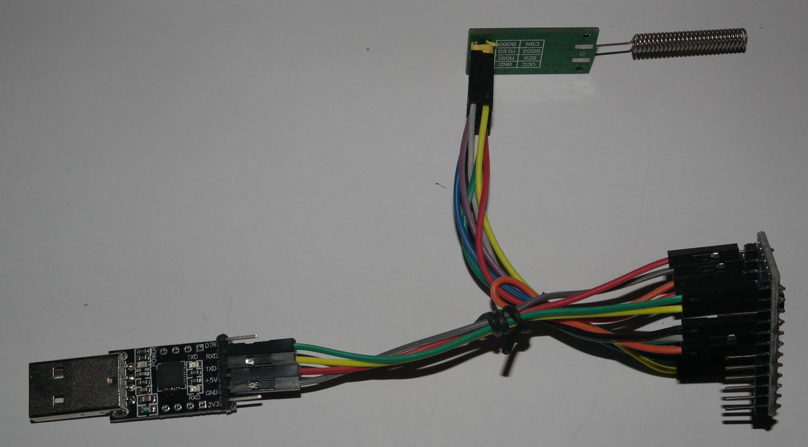

## Installation

In order to use rfboot succesfully there are quite a few steps initially but after that
the process is simple.
You need to:
- Install the apropriate software in the PC
- Download and install rfboot from github
- Assemble and configure the usb2rf module (Connects to a USB port of the PC)
- Configure rftool to use the usb2rf module
- Burn the apropriate firmware to usb2rf (An Arduino sketch)


***

### Install the apropriate software
First of all a linux PC is needed, for the development. I don't use Windows neither MAC
and is very difficult for me to support another platform. You can use VirtualBox if
you really need to use rfboot from Windows or Mac.
I tried with Virtualbox (a Linux Mint 17.3 image) and it is working perfectly.
Of course if you are unfamiliar with linux and especially the command line the problem
remains.

I did all development on a Linux Mint 17 box. Probably you need to adapt the procedure
for your environment.

```
> sudo apt-get update ; sudo apt-get upgrade # this is recommended before start

> sudo apt-get install arduino-core arduino-mk   # This also installs avr compiler and avr-libc

> sudo apt-get install geany # A programmers editor. You can use another if you like.
                             # The instructions here, use geany as text editor

> sudo apt-get install git   # To easily download rfboot.
```

Download the rfboot repository in your PC. Place it in some relatively safe place in your
PC like ~/programming/

```
mkdir ~/programming
cd ~/programming
git clone https://github.com/pkarsy/rfboot.git
```
The "rftool" utility needs to be in the PATH.
```
# if the ~/bin does not exist "mkdir ~/bin" and then logout and login again
> cd ~/bin
> chmod +x ~/programming/rfboot/rftool/rftool
> ln -s ~/programming/rfboot/rftool/rftool
```
Now if you type
```
> rftool
```
Should give you a small usage message. This means rftool is in the PATH.
Now it is time to install mCC1101, a modified (and simplified) panStamp
CC1101 library. Change "~/sketchbook" with your actual sketchbook folder.

```
> cd ~/sketchbook
> git clone https://github.com/pkarsy/mCC1101.git
```

Linux by default does not give permission (to regular users) to
access the Serial ports, neither the ISP programmers. To fix it:

- Serial port
```
> sudo adduser myusername dialout
```
You need to logout and login again for the changes to take effect.
- ISP programmer

```
> sudo nano /etc/udev/rules.d/52-my.rules
```
Add the lines
```
# USBasp
ATTR{idVendor}=="16c0", ATTR{idProduct}=="05dc", MODE="666"

# USBtiny
ATTR{idVendor}=="1781", ATTR{idProduct}=="0c9f", MODE="666"
```

In the command line
```
> sudo service udev restart
```

***Software installation is done !***

***

### usb2rf module

To build the usb2rf module you need
- FTDI module
- ProMini 3.3V
- CC1101 module
- some jumper wires.

```
+----------+
|          |         +-------+          +----------+         +--------+
| gtkterm  |  <--->  |  FTDI |  <--->   | Pro mini |  <--->  | CC1101 |
| rftool   |   USB   +-------+  Serial  +----------+   SPI   +--------+
+----------+
   PC                |                  usb2rf module                 |
                     +------------------------------------------------+
```

Here is a photo of the materials we need


***Serial connection.***
The FTDI module is configured for 3.3V output.


FTDI | Pro Mini
---- | --------
GND  | GND
CTS  | GND
VCC  | VCC
TX   | RX
RX   | TX
DTR NC | GRN NC

Note the DTR is not connected wich means no autoreset. This is VERY importand for the
intended use of the module.
No jumper cables are required. The male FTDI socket fits to the female proMini
Just warp/cut the DTR pin to prevent connection. Another option is to leave the
DTR pin connected and wire a 10uF capacitor between RST-GND pin in proMini.


***The SPI intreface***

RF Module PIN | Cable COLOR | ProMini pin
------------- | ----------- | -----------
GND | Black | GND
VCC | Red | 3.3V
CSN | Yellow | 10
SCK | Green | 13
MOSI | Blue | 11
MISO | Violet | 12
GDO0 | Gray | 2
GDO2 | NC | NC

Finally, connect with a Female-Female cable the proMini pins D3 and RST.


Note the missing DTR pin

And here is the final module



### Configure rftool to use the usb2rf module
```
rftool addport
```
when we insert the usb2rf module, rftool detects it and saves the Serial port device
to ~/.usb2rf file. You can have more than one usb2rf devices.

### Burn the apropriate firmware to usb2rf
You can build the sketch by yourself. (see readme in the usb2rf folder)
or upload the precompiled .hex
```
> cd usb2rf
> make sendHex
```
You may need to press proMini reset button as autoreset does not work.

***Hardware and software setup is done !***

Continue with
[The First Project](The-First-Project.md)

